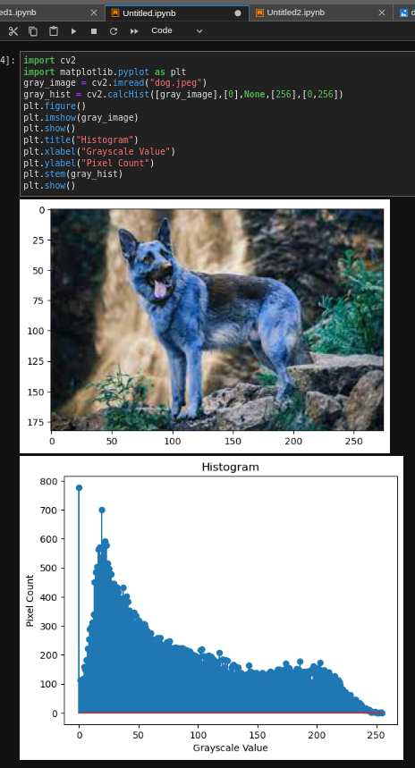

# Histogram and Histogram Equalization of an image
## Aim
To obtain a histogram for finding the frequency of pixels in an Image with pixel values ranging from 0 to 255. Also write the code using OpenCV to perform histogram equalization.

## Software Required:
Anaconda - Python 3.7

## Algorithm:
### Step1:
Import cv2, matplotlib.py libraries and display the saved images using cv2.imshow().
### Step2:
Use cv2.calcHist(images, channels, mask, histSize, ranges[, hist[, accumulate]]) to find the histogram of the image.
### Step3:
Plot the image and its stem plots using the plt.show() and plt.stem() functions.
### Step4:
Equalize the grayscale image using the in-built function cv2.equalizeHist().
### Step5:
Print the original and equalized image using cv2.imshow() and end the program.

## Program:
```python
# Developed By: Sai Praneeth K
# Register Number: 212222230067
```
# Write your code to find the histogram of gray scale image and color image channels.
```python
import cv2
import matplotlib.pyplot as plt
gray_image = cv2.imread("dog.jpeg")
color_image = cv2.imread("house.jpeg",-1)
cv2.imshow("Gray Image",gray_image)
cv2.imshow("Colour Image",color_image)
cv2.waitKey(0)
cv2.destroyAllWindows()
```
# Display the histogram of gray scale image and any one channel histogram from color image
```python
import cv2
import matplotlib.pyplot as plt
gray_image = cv2.imread("dog.jpeg")
gray_hist = cv2.calcHist([gray_image],[0],None,[256],[0,256])
plt.figure()
plt.imshow(gray_image)
plt.show()
plt.title("Histogram")
plt.xlabel("Grayscale Value")
plt.ylabel("Pixel Count")
plt.stem(gray_hist)
plt.show()
```

```pythoon
import cv2
import matplotlib.pyplot as plt
color_image = cv2.imread("house.jpeg",-1)
color_hist = cv2.calcHist([color_image],[0],None,[256],[0,256])
plt.show()
plt.imshow(color_image)
plt.show()
plt.title("Histogram of Color Image - Green Channel")
plt.xlabel("Intensity Value")
plt.ylabel("Pixel Count")
plt.stem(color_hist)
plt.show()
```
# Write the code to perform histogram equalization of the image. 
```python
import cv2
import matplotlib.pyplot as plt
gray_image = cv2.imread("dog.jpeg",0)
cv2.imshow("Gray Image",gray_image)
equ = cv2.equalizeHist(gray_image)
cv2.imshow("Equalized Image",equ)
cv2.waitKey(0)
cv2.destroyAllWindows
```
## Output:
### Input Grayscale Image and Color Image

### Histogram of Grayscale Image and any channel of Color Image


### Histogram Equalization of Grayscale Image

## Result: 
Thus the histogram for finding the frequency of pixels in an image with pixel values ranging from 0 to 255 is obtained. Also,histogram equalization is done for the gray scale image using OpenCV.
